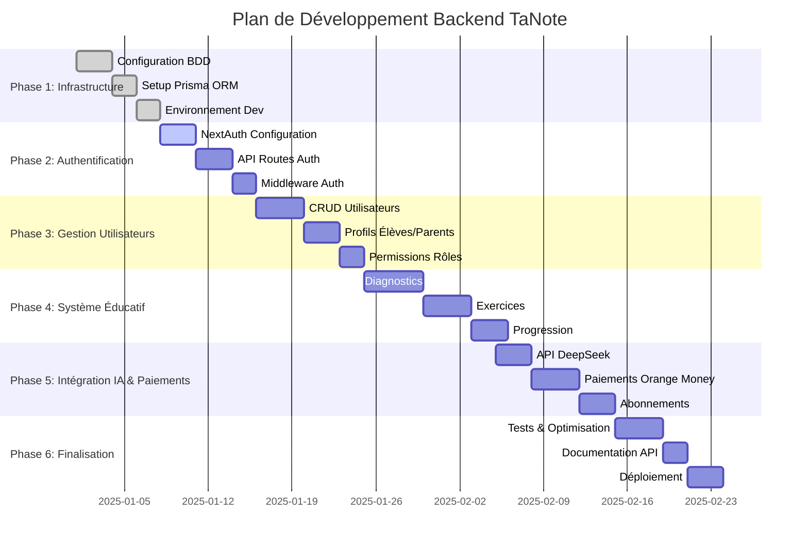

# Plan de Développement Backend - TaNote

## 🎯 Objectif Général
Développer une infrastructure backend robuste et scalable pour la plateforme éducative TaNote, permettant la gestion des utilisateurs, des contenus éducatifs, et des paiements.

---

## 📋 Vue d'Ensemble des Phases

---

## 🏗️ Phase 1: Infrastructure Base (7 jours)

### Étape 1.1: Configuration Base de Données (3 jours)
**Objectif**: Mettre en place une base de données PostgreSQL robuste

**Tâches**:
- [ ] Créer compte PostgreSQL (local ou cloud)
- [ ] Configurer base de données `tanote_db`
- [ ] Définir schéma initial des tables
- [ ] Configurer variables d'environnement
- [ ] Tester connexion depuis l'application

**Livrables**:
- Base de données fonctionnelle
- Fichier `.env.local` configuré
- Script de création des tables

### Étape 1.2: Setup Prisma ORM (2 jours)
**Objectif**: Intégrer Prisma pour la gestion de la base de données

**Tâches**:
- [ ] Installer Prisma CLI et client
- [ ] Initialiser Prisma dans le projet
- [ ] Créer schéma Prisma complet
- [ ] Générer client Prisma
- [ ] Créer scripts de migration

**Livrables**:
- `schema.prisma` complet
- Client Prisma généré
- Scripts de migration

### Étape 1.3: Configuration Environnement (2 jours)
**Objectif**: Préparer l'environnement de développement

**Tâches**:
- [ ] Configurer variables d'environnement
- [ ] Mettre en place validation des variables
- [ ] Créer scripts de développement
- [ ] Configurer logging

**Livrables**:
- Configuration environnement complète
- Scripts de développement prêts

---

## 🔐 Phase 2: Authentification Sécurisée (8 jours)

### Étape 2.1: Configuration NextAuth.js (3 jours)
**Objectif**: Implémenter un système d'authentification robuste

**Tâches**:
- [ ] Configurer NextAuth.js avec Prisma adapter
- [ ] Définir providers (email, Google, etc.)
- [ ] Configurer JWT sessions
- [ ] Mettre en place pages d'authentification
- [ ] Configurer callbacks personnalisés

**Livrables**:
- `[...nextauth].ts` configuré
- Pages d'authentification fonctionnelles
- Sessions JWT sécurisées

### Étape 2.2: API Routes d'Authentification (3 jours)
**Objectif**: Créer les endpoints API pour l'authentification

**Tâches**:
- [ ] Créer `app/api/auth/register/route.ts`
- [ ] Créer `app/api/auth/login/route.ts`
- [ ] Créer `app/api/auth/logout/route.ts`
- [ ] Créer `app/api/auth/forgot-password/route.ts`
- [ ] Créer `app/api/auth/reset-password/route.ts`
- [ ] Implémenter validation avec Zod

**Livrables**:
- 5 API routes d'authentification
- Validation des données robuste
- Gestion des erreurs

### Étape 2.3: Middleware d'Authentification (2 jours)
**Objectif**: Protéger les routes nécessitant une authentification

**Tâches**:
- [ ] Créer middleware de vérification
- [ ] Protéger routes dashboard
- [ ] Gérer redirections
- [ ] Implémenter refresh tokens

**Livrables**:
- Middleware d'authentification
- Routes protégées fonctionnelles

---

## 👥 Phase 3: Gestion des Utilisateurs (9 jours)

### Étape 3.1: CRUD Utilisateurs (4 jours)
**Objectif**: Implémenter la gestion complète des utilisateurs

**Tâches**:
- [ ] Créer `app/api/users/profile/route.ts` (GET/PUT)
- [ ] Créer `app/api/users/settings/route.ts` (GET/PUT)
- [ ] Créer `app/api/users/delete/route.ts` (DELETE)
- [ ] Implémenter validation des données
- [ ] Gérer les permissions d'accès

**Livrables**:
- API routes CRUD utilisateurs
- Validation des données
- Gestion des permissions

### Étape 3.2: Profils Élèves/Parents (3 jours)
**Objectif**: Gérer les profils spécifiques selon les rôles

**Tâches**:
- [ ] Créer `app/api/students/profile/route.ts`
- [ ] Créer `app/api/parents/profile/route.ts`
- [ ] Implémenter gestion enfants-parents
- [ ] Créer formulaires de profil

**Livrables**:
- Profils spécialisés fonctionnels
- Relation parent-enfant

### Étape 3.3: Système de Permissions (2 jours)
**Objectif**: Implémenter un système de rôles et permissions

**Tâches**:
- [ ] Définir rôles (admin, parent, student)
- [ ] Créer middleware de permissions
- [ ] Implémenter vérifications par route
- [ ] Gérer escalade de privilèges

**Livrables**:
- Système de rôles complet
- Middleware de permissions

---

## 📚 Phase 4: Système Éducatif (12 jours)

### Étape 4.1: Module de Diagnostics (5 jours)
**Objectif**: Créer un système de diagnostic éducatif

**Tâches**:
- [ ] Créer `app/api/diagnostics/create/route.ts`
- [ ] Créer `app/api/diagnostics/submit/route.ts`
- [ ] Créer `app/api/diagnostics/results/route.ts`
- [ ] Implémenter algorithme de correction
- [ ] Générer recommandations personnalisées

**Livrables**:
- Système de diagnostic complet
- Algorithme d'analyse
- Recommandations personnalisées

### Étape 4.2: Gestion des Exercices (4 jours)
**Objectif**: Implémenter la création et gestion d'exercices

**Tâches**:
- [ ] Créer `app/api/exercises/generate/route.ts`
- [ ] Créer `app/api/exercises/submit/route.ts`
- [ ] Créer `app/api/exercises/list/route.ts`
- [ ] Implémenter niveaux de difficulté
- [ ] Gérer types d'exercices

**Livrables**:
- API de génération d'exercices
- Système de soumission
- Gestion des niveaux

### Étape 4.3: Suivi de Progression (3 jours)
**Objectif**: Mettre en place un système de suivi des progrès

**Tâches**:
- [ ] Créer `app/api/progress/update/route.ts`
- [ ] Créer `app/api/progress/stats/route.ts`
- [ ] Créer `app/api/progress/history/route.ts`
- [ ] Implémenter calcul de progression
- [ ] Générer rapports détaillés

**Livrables**:
- Système de suivi complet
- Statistiques et rapports
- Historique des progrès

---

## 🤖 Phase 5: Intégration IA & Paiements (10 jours)

### Étape 5.1: Intégration DeepSeek IA (3 jours)
**Objectif**: Intégrer l'IA pour la génération de contenu

**Tâches**:
- [ ] Configurer client DeepSeek API
- [ ] Créer `app/api/ai/generate-exercise/route.ts`
- [ ] Créer `app/api/ai/correct-answer/route.ts`
- [ ] Implémenter gestion des tokens
- [ ] Optimiser prompts

**Livrables**:
- Intégration DeepSeek fonctionnelle
- Génération d'exercices IA
- Correction automatique

### Étape 5.2: Paiements Orange Money & Wave (4 jours)
**Objectif**: Intégrer les solutions de paiement africaines

**Tâches**:
- [ ] Créer `app/api/payments/orange-money/route.ts`
- [ ] Créer `app/api/payments/wave/route.ts`
- [ ] Implémenter webhooks de notification
- [ ] Gérer échecs et annulations
- [ ] Sécuriser les transactions

**Livrables**:
- Intégration Orange Money
- Intégration Wave
- Gestion des webhooks

### Étape 5.3: Gestion des Abonnements (3 jours)
**Objectif**: Mettre en place le système d'abonnements

**Tâches**:
- [ ] Créer `app/api/subscriptions/subscribe/route.ts`
- [ ] Créer `app/api/subscriptions/cancel/route.ts`
- [ ] Créer `app/api/subscriptions/status/route.ts`
- [ ] Implémenter renouvellements automatiques
- [ ] Gérer downgrades/upgrades

**Livrables**:
- Système d'abonnements complet
- Gestion automatique des renouvellements

---

## 🚀 Phase 6: Finalisation & Déploiement (9 jours)

### Étape 6.1: Tests & Optimisation (4 jours)
**Objectif**: Assurer la qualité et la performance

**Tâches**:
- [ ] Écrire tests unitaires pour les API
- [ ] Effectuer tests d'intégration
- [ ] Optimiser les requêtes BDD
- [ ] Implémenter cache Redis
- [ ] Tester sous charge

**Livrables**:
- Suite de tests complète
- Performances optimisées
- Cache implémenté

### Étape 6.2: Documentation API (2 jours)
**Objectif**: Documenter toutes les API routes

**Tâches**:
- [ ] Créer documentation OpenAPI/Swagger
- [ ] Documenter chaque endpoint
- [ ] Créer exemples d'utilisation
- [ ] Documenter schémas de données
- [ ] Créer guide d'intégration

**Livrables**:
- Documentation API complète
- Guide d'intégration
- Exemples fonctionnels

### Étape 6.3: Déploiement Production (3 jours)
**Objectif**: Déployer l'application en production

**Tâches**:
- [ ] Configurer environnement production
- [ ] Mettre en place CI/CD
- [ ] Déployer sur Vercel/AWS
- [ ] Configurer monitoring
- [ ] Effectuer tests finaux

**Livrables**:
- Application déployée
- CI/CD configuré
- Monitoring en place

---

## 📊 Indicateurs de Succès

### Métriques Techniques
- **Temps de réponse API** < 200ms
- **Uptime** > 99.9%
- **Couverture de tests** > 80%
- **Score performance** > 90

### Métriques Fonctionnelles
- **Authentification** : 100% fonctionnelle
- **CRUD utilisateurs** : Complet
- **Système éducatif** : Opérationnel
- **Paiements** : Intégrés et sécurisés

---

## 🔄 Gestion des Risques

### Risques Identifiés
1. **Complexité intégration IA** : Mitigation par tests incrémentaux
2. **Stabilité paiements** : Mitigation par webhooks robustes
3. **Performance base de données** : Mitigation par optimisation progressive
4. **Sécurité** : Mitigation par audits réguliers

### Plan de Contingence
- **Retards** : Réallocation des ressources
- **Bugs critiques** : Hotfixes immédiats
- **Problèmes performance** : Scaling horizontal

---

## 📋 Checklist Finale

### Avant de Passer à la Phase Suivante
- [ ] Tous les tests passent
- [ ] Documentation à jour
- [ ] Code review effectuée
- [ ] Performance validée
- [ ] Sécurité vérifiée

### Livrables Finaux
- [ ] Backend complet et fonctionnel
- [ ] Documentation technique
- [ ] Guide de déploiement
- [ ] Monitoring configuré
- [ ] Support utilisateur prêt

---

*Plan créé le 19/12/2025*
*Durée estimée totale : 45 jours*
*Dernière mise à jour : Version 1.0*